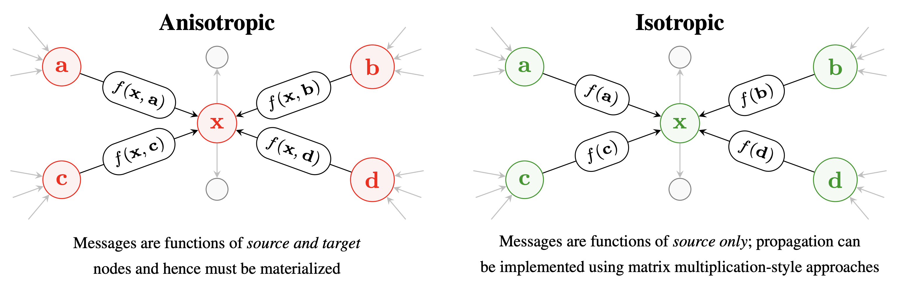

# Do We Need Anisotropic Graph Neural Networks?

[](https://arxiv.org/abs/2104.01481)
[](https://github.com/psf/black)
[](https://opensource.org/licenses/MIT)
[](https://twitter.com/satailor96)



## Overview

This repo provides the implementation of the Efficient Graph Convolution (EGC) layer using PyTorch Geometric.
We include hyperparameters and pretrained models (even for baselines which we trained!).

- `hyperparameters.md` contains hyperparameters and experiment details.
- `experiments/layers.py` contains the layer definitions for EGC, and is likely what you are most interested in. There's also an optimized implementation that was upstreamed to PyTorch Geometric in `experiments/optimized_layers.py`.
- The `experiments` directory contains subdirectories for each experiment dataset.
- The code is structured using my experiment tuning library ([exptune](https://github.com/shyam196/exptune)) which enables fast hyperparameter search + training of final models + plotting and so on. This is bundled under the `third_party` directory as a git submodule. Beyond these dependencies, we use PyTorch Geometric and OGB. 
- To retrain the main table + ablation studies, you can use `train_main_table.sh` and `train_ablation.sh`.
- To run the pre-trained models, use `run_pretrained.sh`.


## Getting Started
Clone the repo **with the submodules** (`--recurse-submodules`) and build the Dockerfile:

```bash
# Clone
git clone https://github.com/shyam196/egc.git --recurse-submodules
# Build
docker build . -t camlsys/egc
# Run
docker run -it --gpus all camlsys/egc bash
```

### Using Pre-Trained Models

The script `run_pretrained.sh` provides all the commands you need to download the models and perform a run over the test set.

### Re-Generating Experiment Results

We provide two scripts to generate the results for the main table, and for the ablation studies.
This is discussed in more depth in `hyperparameters.md`.

## Citing This Work

```
@inproceedings{
tailor2022egc,
title={Do We Need Anistropic Graph Neural Networks?},
author={Shyam A. Tailor and Felix Opolka and Pietro Lio and Nicholas Donald Lane},
booktitle={International Conference on Learning Representations},
year={2022},
url={https://openreview.net/forum?id=hl9ePdHO4_s}
}
```
